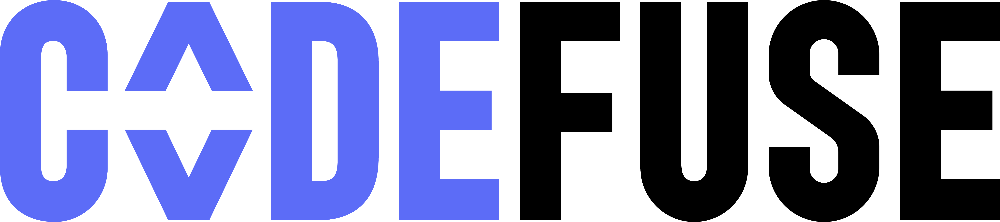

Hello World! This is codefuse-ai! 

  

[**简体中文**](README_CN.md)|[**HF Repo**](https://huggingface.co/codefuse)

**The mission of CodeFuse is to develop Code Large Language Models (Code LLMs) specifically designed to support the entire software development lifecycle, covering crucial stages such as design, requirements, coding, testing, deployment, operations, and maintenance.** We are passionate about creating innovative solutions that empower developers throughout the software development process.

In this release, we are open sourcing 
1. [**the MFT (Multi-Task Fine-Tuning) framework, known as MFTcoder**](https://github.com/codefuse-ai/MFTCoder);
2. **two datasets for enhancing the coding capabilities of LLMs**, that is, [Code Exercise](https://huggingface.co/datasets/codefuse/CodeExercise-Python-27k) and [Evol-Instruction](https://huggingface.co/datasets/codefuse/Evol-instruction-66k);
3. [**a faster and more reliable deployment framework based on FasterTransformer**](https://github.com/codefuse-ai/FasterTransformer4CodeFuse);

The resulting model ensemble, which includes CodeFuse-13B and CodeFuse-CodeLlama-34B, supports various code-related tasks such as code completion, text-to-code conversion, and unit test generation. In particular, CodeFuse-CodeLlama-34B, built upon CodeLlama as the base model and fine-tuned using the proposed MFT framework, achieves an impressive score of **74.4% (greedy decoding)** in the HumanEval Python pass@1 evaluation, **even surpassing the performance of GPT-4 (71%)**. We have plans to incorporate additional base LLMs into the ensemble in the near future.

We believe that our solution can significantly enhance the performance of pretrained LLMs across multiple related tasks simultaneously. We are committed to further exploring this direction and providing more open-source contributions. We also encourage engineers and researchers within this community to join us in co-constructing CodeFuse.